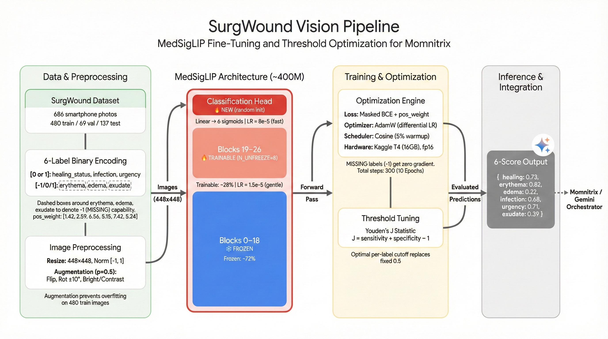

# Momnitrix

**An AI-powered maternal health triage system that puts clinician-grade risk assessment on a pregnant woman's wrist — powered by four Google HAI-DEF models working in concert.**

---

### Project Name

**Momnitrix** — Maternal health monitoring, reimagined for the wrist.

---

### Your Team

| Name | Role | Links |
|------|------|-------|
| [Tayyab Khan](https://www.kaggle.com/kkfkmf) | **ML Engineering & Full-Stack** — Fine-tuned MedGemma + MedSigLIP, built the SFT data pipeline, architected the Modal backend, and developed the web app. | [LinkedIn](https://www.linkedin.com/in/tayyab-khan-159153282/) · [X/Twitter](https://x.com/tayyabito) · [Medium](https://medium.com/@tayyabito) |
| [Sahil Tanna](https://www.kaggle.com/sahiltanna) | **Mobile & Wearable Engineering** — Built the watchOS app in SwiftUI, integrated HealthKit vitals syncing, and led device testing across smartwatch hardware. | [LinkedIn](https://www.linkedin.com/in/sahiltanna7/) |
| [Nikunj Sinha](https://www.kaggle.com/nikunj3004) | **Clinical Research & Validation** — Led the maternal health literature review (ACOG/WHO), curated training data context, and audited model outputs for clinical accuracy. | [LinkedIn](https://www.linkedin.com/in/kumar-nikunj-sinha-kns/) |

---

### Problem Statement

**The gap between prenatal visits is where mothers die.**

Maternal mortality is one of the most preventable crises in modern healthcare. Globally, 287,000 women die annually from pregnancy-related complications — and 80% of those deaths are preventable with timely detection. The leading killers — preeclampsia, gestational diabetes, postpartum hemorrhage, sepsis — don't announce themselves at scheduled appointments. They develop silently in the 2–4 week windows *between* visits, when no one is watching.

Here's what makes this absurd in 2025: the data to catch these conditions *already exists*. A Samsung Watch 4 can measure blood pressure. A phone camera can photograph a C-section wound. A voice memo can describe symptoms. The raw signal is there — what's missing is *clinical interpretation at the moment it matters*. A woman sees "138/88" on her wrist at 11pm and has no idea whether that's normal at 32 weeks. She photographs a reddening incision and sends it to a family group chat hoping someone knows what infection looks like. She describes "really bad headaches and puffy hands" and doesn't realize she just listed two classic preeclampsia red flags.

**Momnitrix closes that interpretation gap.** We turn smartwatch vitals, wound photos, and voice check-ins into structured, clinician-aligned risk assessments — powered by four Google HAI-DEF models, each doing exactly what it was built to do.

**The impact math is straightforward.** Preeclampsia alone affects ~8 million pregnancies annually and causes ~76,000 maternal deaths per year. Its diagnostic threshold — BP ≥140/90 mmHg on two readings — is trivially measurable by a consumer smartwatch. If even 1% of high-risk pregnancies in high-burden countries used a system like Momnitrix, and early detection reduced severe outcomes by a conservative 30%, that's roughly **23,000 maternal outcomes improved per year**. Post-C-section wound infections affect 3–15% of the 32% of US births that are cesarean — and Momnitrix puts structured wound surveillance in every mother's hands from day one post-discharge.

The core equity argument: a woman in rural Maharashtra or sub-Saharan Africa with a mid-range phone and a $10/month data plan should receive the same quality of clinical reasoning as a patient at a tertiary care center in Manhattan. Open-weight HAI-DEF models running on Modal infrastructure make that possible at 1/20th the cost of proprietary API calls — with patient data never leaving a controlled inference environment.

---

### Overall Solution

Momnitrix orchestrates **four HAI-DEF models** — each used for the specific task it was designed for, not bolted on as an afterthought:

**MedGemma 1.5 4B-IT** (LoRA fine-tuned) serves as the clinical reasoning core. We fine-tuned it on 912 maternal health samples to produce structured 5-part risk assessments — risk level, clinical interpretation tied to specific thresholds, likely complications, week-appropriate management actions, and red-flag warnings. The fine-tuned model doesn't just say "HIGH risk." It says *why* — citing that 148/96 exceeds the 140/90 preeclampsia threshold, that 6.2 mmol/L fasting glucose surpasses the 5.1 mmol/L GDM cutoff, and that week-34 management differs from week-36. A general-purpose LLM hallucinates these thresholds. MedGemma, fine-tuned on maternal data, *knows* them.

**MedSigLIP** (fine-tuned) handles wound image classification. We trained a 6-label clinical head on the SurgWound dataset (686 surgical wound images) to assess healing status, erythema, edema, infection risk, urgency, and exudate. These structured scores feed directly into MedGemma for natural language interpretation — a deliberate signal-to-language handoff between two HAI-DEF models.

**Derm Foundation** powers skin condition triage. Using pre-computed embeddings from Google's dermatology-specific foundation model, we trained a lightweight classifier on the SCIN dataset to identify 10 common skin conditions — including pregnancy-relevant ones like urticaria (PUPPP affects 1 in 160 pregnancies) and eczema. When the Gemini Flash orchestrator detects a skin image rather than a wound, it routes to Derm Foundation instead of MedSigLIP.

**MedASR** transcribes voice symptom check-ins with medical-domain accuracy. General ASR chokes on "preeclampsia," "lochia," "fundal height." MedASR doesn't. Combined with MedGemma's clinical reasoning, this creates a voice-based triage pipeline that could genuinely replace a phone nurse callback.

The orchestration layer (Gemini Flash) routes each input to the right specialist, fuses outputs, applies hard-coded clinical safety guardrails (BP ≥160/110 *always* triggers RED regardless of model output), and streams a unified patient-facing response via SSE.

**Why HAI-DEF and not GPT-4?** Cost, control, and clinical grounding. MedGemma with a LoRA adapter on a Modal A10G delivers GPT-4-quality medical reasoning at a fraction of the cost. The patient's data never hits a third-party API. And the medical pre-training means we're fine-tuning a model that already understands clinical vocabulary — not teaching one from scratch.

---

### Technical Details

Our technical implementation centers on **two primary fine-tuning pipelines** and a production-grade deployment stack.

#### Fine-Tune #1: MedGemma LoRA for Maternal Risk Reasoning

**SFT Data Pipeline**


We built a custom supervised fine-tuning dataset from the [UCI Maternal Health Risk dataset](https://archive.ics.uci.edu/dataset/863/maternal+health+risk) (originally collected via IoT-based monitoring systems as described in Ahmed et al., *"Review and Analysis of Risk Factor of Maternal Health in Remote Area Using the Internet of Things (IoT)"*, Lecture Notes in Electrical Engineering, vol 632, 2020). Each of the 1,014 rows was enriched with synthetic obstetric context — gestational week (8–40), trimester derivation, gravida/para history, and BMI category — using deterministic per-row RNG for reproducibility. Instruction prompts were randomly sampled from 4 varied clinical templates to prevent format overfitting. Responses were generated via Gemini Flash with rule-based validation against ACOG/WHO guidelines, falling back to a template engine when the API was unavailable. Every response passed quality gates: correct 5-section format (`RISK LEVEL` → `CLINICAL REASONING` → `POTENTIAL COMPLICATIONS` → `RECOMMENDED ACTIONS` → `WARNING SIGNS`), 800–2,000 characters, no AI disclaimers, and at least 3 actionable bullet points. The final formatted output applies the Gemma 3 chat template (`<start_of_turn>user/model<end_of_turn>`) and splits 90/10 into 912 train / 102 eval samples.

**LoRA Fine-Tuning Pipeline**


We fine-tuned `google/medgemma-1.5-4b-it` using LoRA (rank 8, alpha 16, all-linear targets) on Kaggle P100 hardware with 4-bit NF4 quantization via BitsAndBytes. Training used HuggingFace TRL's `SFTTrainer` with bfloat16 precision, Liger fused kernels (RoPE, RMS norm, fused linear cross-entropy), and gradient checkpointing. Because MedGemma 1.5 is a multimodal VLM with a full SigLIP vision tower, we stripped the vision encoder during training by replacing it and the multi-modal projector with lightweight `DummyModule`s — reclaiming ~1.5 GB of VRAM that was critical for fitting the model in 16 GB. At inference, the LoRA adapter loads onto the *unmodified* base model with the vision encoder fully intact.

<details>
<summary><b>Training configuration</b></summary>

| Parameter | Value |
|-----------|-------|
| LoRA rank (`r`) | 8 |
| LoRA alpha | 16 |
| LoRA dropout | 0.05 |
| Target modules | `all-linear` (Q, K, V, O, gate, up, down projections) |
| Quantization | 4-bit NF4 (`bnb_4bit_compute_dtype=bfloat16`) |
| Max sequence length | 768 |
| Learning rate | 2e-4 (cosine scheduler) |
| Warmup ratio | 0.05 |
| Batch size | 1 (gradient accumulation = 8, effective batch = 8) |
| Epochs | 3 (342 total optimizer steps) |
| Optimizer | `adamw_torch_fused` |
| Gradient checkpointing | Enabled |
| Max grad norm | 0.3 |
| Precision | bfloat16 |

</details>

<details>
<summary><b>Training loss curve</b></summary>

| Step | Training Loss | Validation Loss |
|------|--------------|----------------|
| 50 | 0.6505 | 0.6193 |
| 100 | 0.5467 | 0.5328 |
| 150 | 0.4800 | 0.5098 |
| 200 | 0.4432 | 0.4875 |
| 250 | 0.4037 | 0.4813 |
| 300 | 0.3893 | 0.4762 |
| **342** | **0.3922** | **0.4762** |

Training completed in **297 minutes** on a single Kaggle P100. Adapter size: **~37.7 MB**.

</details>

**Result**: The fine-tuned model correctly identifies pregnancy-specific glucose thresholds (5.1 mmol/L) that the base model misses entirely — calling 6.2 mmol/L "within normal range" vs. correctly flagging it as above the GDM cutoff. On a high-risk test case (BP 145/95, glucose 8.5 mmol/L, 32 weeks), it produces a fully structured 5-section clinical response with threshold-linked reasoning, trimester-appropriate actions, and clinically accurate complication lists.

#### Fine-Tune #2: MedSigLIP for Surgical Wound Assessment



We fine-tuned `google/medsiglip-448` with selective unfreezing of the last 8 of 27 ViT encoder blocks (28.4% of parameters) plus a new 6-label sigmoid classification head, trained on the [SurgWound dataset](https://huggingface.co/datasets/xuxuxuxuxu/SurgWound) (686 surgical wound images annotated by 3 board-certified surgeons; see [Xu et al., 2025](https://arxiv.org/abs/2508.15189)). We used differential learning rates (backbone: 1.5e-5, head: 8e-5) to preserve pre-trained features while allowing the classification head to converge quickly.

The **masked BCE loss** function is a key design choice — three of the six labels (`erythema`, `edema`, `exudate`) have MISSING values in the dataset. Rather than dropping entire samples, the loss zeros out gradient contributions for MISSING entries per-element, retaining maximum signal from every image:

```python
mask = (labels >= 0).float()       # 1 where valid, 0 where MISSING
per_element_loss = bce_with_logits(logits, labels.clamp(min=0))
loss = (per_element_loss * mask).sum() / mask.sum()
```

Class imbalance is addressed with pre-computed `pos_weight` vectors (e.g., urgency at 7.42× for the minority positive class). Per-label decision thresholds were tuned post-training via Youden's J statistic on the validation set, correcting miscalibration from the initial fixed-0.5 cutoff.

<details>
<summary><b>Training configuration</b></summary>

| Parameter | Value |
|-----------|-------|
| Unfrozen blocks | Last 8 of 27 ViT encoder blocks |
| Trainable parameters | ~28.4% (~110M of 400M) |
| Backbone learning rate | 1.5e-5 |
| Head learning rate | 8e-5 |
| Weight decay | 0.015 |
| Batch size | 4 (gradient accumulation = 4, effective batch = 16) |
| Epochs | 10 (300 total optimizer steps) |
| Scheduler | Cosine with warmup (5%) |
| Loss | Masked BCE with `pos_weight=[1.42, 2.59, 6.56, 5.15, 7.42, 5.24]` |
| Image size | 448 × 448 |
| Augmentation | Horizontal flip, ±10° rotation, brightness/contrast jitter |

</details>

<details>
<summary><b>Results (137 test images)</b></summary>

| Label | AUC | Sensitivity | Specificity | Youden's J Threshold |
|-------|-----|-------------|-------------|---------------------|
| `healing_status` | 0.7183 | 0.72 | 0.71 | 0.43 |
| `erythema` | 0.6860 | 0.69 | 0.68 | 0.51 |
| `edema` | 0.7129 | 0.78 | 0.65 | 0.38 |
| `infection_risk` | 0.8102 | 0.90 | 0.72 | 0.35 |
| `urgency` | 0.8215 | 0.875 | 0.77 | 0.29 |
| `exudate` | 0.7211 | 0.73 | 0.71 | 0.44 |
| **Macro AUC** | **0.7450** | — | — | — |

22.5 minutes of training on a Kaggle T4 GPU. For context: 3 of 6 labels have MISSING values, class imbalance is severe (urgency: 88% negative), and the model started from frozen pretrained features. This is the HAI-DEF foundation doing exactly what it's supposed to do — transferring medical image understanding with minimal data.

</details>

#### Derm Foundation Classifier

Lightweight linear probe on pre-computed 6144-dim embeddings from `google/derm-foundation`, trained on the [SCIN dataset](https://github.com/google-research-datasets/scin) (5,000+ volunteer images, dermatologist-labeled). No GPU fine-tuning required — the foundation model's representations are strong enough that logistic regression achieves clinically useful AUCs across 10 skin conditions. A small neural network head (6144 → 256 → 128 → 10 sigmoid) improved Hamming loss from 0.118 to **0.113** and boosted individual AUCs (Eczema: 0.71 → **0.76**, Urticaria: 0.89 → **0.92**).

#### Deployment Stack

The production backend runs on **Modal** with four containerized services:

| Service | Hardware | Function |
|---------|----------|----------|
| `momnitrix-core-gpu` | A100-40GB | MedGemma (LoRA adapter) + MedSigLIP inference |
| `momnitrix-derm-tf` | T4 | Derm Foundation embeddings + sklearn/Keras classifier |
| `momnitrix-medasr` | CPU × 4 | MedASR CTC transcription + post-processing |
| `momnitrix-api-v2` | CPU × 2 | Orchestration, Gemini Flash calls, SSE streaming |

Specialist models execute concurrently via `asyncio.gather` — latency equals the slowest specialist, not the sum. SSE streaming gives real-time frontend feedback at every pipeline stage (`router.decision` → `model.started` → `medgemma.completed` → `gemini.delta` → `triage.final`). Hard-coded policy floors ensure clinical safety rules (BP ≥160/110 = RED, headache + vision changes = RED, decreased fetal movement = RED) can **never** be overridden by model hallucination. Heuristic fallbacks maintain availability if any GPU model fails.

| Asset | Location |
|-------|----------|
| MedGemma LoRA adapter | [`tyb343/mamaguard-vitals-lora-p100`](https://huggingface.co/tyb343/mamaguard-vitals-lora-p100) |
| MedSigLIP wound classifier | [`tyb343/medsiglip-448-surgwound-v2`](https://huggingface.co/tyb343/medsiglip-448-surgwound-v2) |
| Live API endpoint | [`momnitrix-api-v2-web.modal.run`](https://tayyabkhn343--momnitrix-api-v2-web.modal.run) |
| MedGemma fine-tuning notebook | [medgemma-lora-fine-tuning-2](https://www.kaggle.com/code/kkfkmf/medgemma-lora-fine-tuning-2) |
| MedSigLIP fine-tuning notebook | [momnitrix-medsiglip-fine-tuning](https://www.kaggle.com/code/kkfkmf/momnitrix-medsiglip-fine-tuning) |
